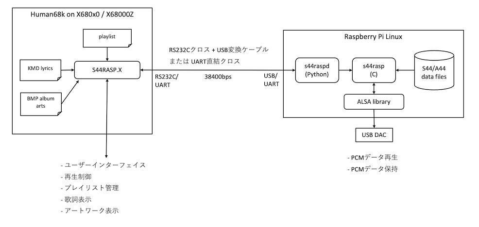
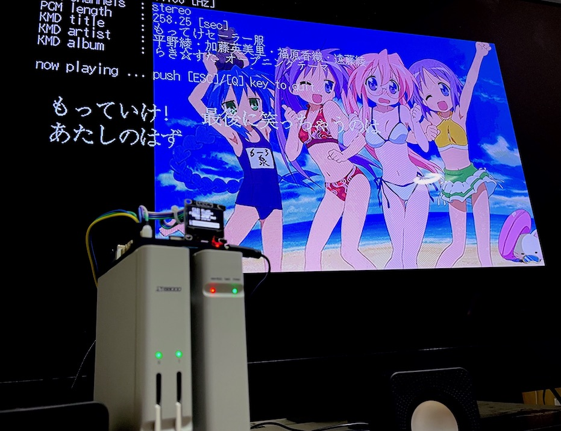

# S44RASP.X

Mercury-Unit S44/A44 data player system for Human68k/X680x0 with Raspberry Pi

---

## About This

まーきゅりーゆにっと用PCM曲データ(S44/A44)を、まーきゅりーゆにっとの無いX680x0で16bitステレオPCMの品質のまま再生させることを目指したプレーヤーシステムです。

- まーきゅりーゆにっとが無くてもオリジナルの音質でステレオPCM再生が可能
- KMD歌詞表示・アルバムアートワーク表示に対応
- インダイレクトファイルによるプレイリスト演奏に対応
- X680x0実機とX68000Zの両方で動作確認済

具体的には Raspberry Pi と X680x0 を RS232C(UART) でクロス接続し、PCMデータ保持および再生は Raspberry Pi 側が担当します。X68kはPCM再生制御を行うとともに、歌詞・アルバムアートワーク表示を行います。

X680x0実機+まーきゅりーゆにっとで[S44EXP.X](https://github.com/tantanGH/s44exp)を利用した時と機能面では同等になります。(ただしWAV及びX68kADPCMは非対応)

KMDデータの詳細および作成については[KMDED.X](https://github.com/tantanGH/kmded)を参照してください。

 

---

## Setup

本ソフトを動作させるには、以下のものが必要です。

* X680x0 (X68000Z可)
* RS232CクロスケーブルおよびRS232C-USB変換ケーブル (X68000Zの場合はUART直結クロスケーブル可)
* Raspberry Pi 3A+/3B+/4B

X68000Z で UART直結を行う場合は、Bluetoothを無効化し、PL011をPrimary UARTとする必要があります。以下のRS-MIDIの例を参考にしてください。
[https://github.com/tantanGH/distribution/blob/main/x68000z/uart-midi-raspi.md](https://github.com/tantanGH/distribution/blob/main/x68000z/uart-midi-raspi.md)

---

## Install (Raspberry Pi)

Raspberry Pi Linux 用 S44/A44プレーヤーである [s44rasp](https://github.com/tantanGH/s44rasp) をあらかじめコンパイルしてパスの通った場所に置いておきます。

ゲートウェイサーバー(ラッパーデーモン)となる s44raspd を pip で導入します。

    pip install git+https://github.com/tantanGH/s44rasp-x68k.git

s44raspd を起動します。

    s44raspd [options] <pcm-data-path>
      pcm-data-path ... PCMデータが置かれたディクレトリのルート ここ以下にあるデータを相対パスで公開することになります

    options:
      -a <alsa-device-name>   ... alsa pcm device name (hw:1,0 など。s44rasp にそのまま渡されます)
      -o                      ... OLED表示を行う (s44rasp にそのまま渡されます)
      -d <serial-device-name> ... serial device name (UART直結なら /dev/serial0, USB serialなら /dev/ttyUSB0 など)
      -s <serial-baud-rate>   ... serial baud rate (default:38400)

ALSAデバイス名は `aplay -l` で確認してください。

SSD1306 OLEDディスプレイが Raspberry Pi に接続されている場合は、`-o` オプションでレベルメータなどを表示することが可能です。

バックグラウンドで起動する例(USB serial)：

    nohup s44raspd -a hw:3,0 -o -d /dev/ttyUSB0 -s 38400 > s44raspd.log &

バックグラウンドで起動する例(UART)：

    nohup s44raspd -a hw:3,0 -o -d /dev/serial0 -s 38400 > s44raspd.log &

---

## Install (X680x0)

S44RPxxx.ZIP をダウンロードして、S44RASP.X をパスの通ったディレクトリにコピーします。

---

## Usage

注意：本プログラムの動作には純正RSDRV.SYSまたはTMSIO.Xが必要です。X68000Zの場合はTMSIO.Xでは正常動作しないので純正RSDRV.SYSをCONFIG.SYSで組み込んでください。

注意：本プログラムはTimer-D割り込みを使うので、他のTimer-D割り込みを使う常駐プログラムとは同時に動作できません。また、CONFIG.SYS内のPROCESS=の行をコメントアウトする必要があります。

引数をつけずに実行するか、`-h` オプションをつけて実行するとヘルプメッセージが表示されます。

        S44RASP.X - S44/A44 PCM player over UART version x.x.x by tantan
        usage: s44rasp [options] <remote-pcm-path> [<remote-pcm-path> ...]
               s44rasp [options] -i <remote-pcm-indirect-file>
               s44rasp [options] -k <kmd-file> [<kmd-file> ...]
               s44rasp [options] -j <kmd-indirect-file>
        options:
               -l<n> ... loop count (default:1)
               -s    ... shuffle mode
               -t<n> ... album artwork brightness (default:75)
               -b<n> ... baud rate (default:38400)
               -h    ... show help message

remote-pcm-path は s44raspd サーバーのデータディレクトリ以下に存在する .s44/.a44 ファイルの相対パス名を与えます。X68k側のローカルファイルではないことに注意してください。ディレクトリの区切りは必ず'/'になります。また日本語ディレクトリ名、日本語ファイル名には対応していないので注意してください。

`-i` を付けるとインダイレクトファイルを指定できます。1行に一つの remote-pcm-path を含めることができます。

`-k` を付けると pcm 相対パスの代わりにローカルにある .KMD ファイルを指定できます。この場合はアートワーク・歌詞表示を行うことができます。remote-pcm-path については KMDに埋め込みを行う必要があります。以下のように開始時刻99:59:99,終了時刻99:59:99のイベントとしてタグRSSN:を使って指定します。

    x0,y0,s02:54:93,e03:07:05,"ああ 赤イ涙 流して "
    x0,y2,s03:00:68,e03:07:05,"この引き金 引くわ "
    x0,y0,s99:59:99,e99:59:99,"TIT2:赤イ涙の先"
    x0,y1,s99:59:99,e99:59:99,"TPE1:朝霧彩(CV.大野柚布子)"
    x0,y2,s99:59:99,e99:59:99,"TALB:魔法少女サイト キャラクターソング"
    x1,y0,s99:59:99,e99:59:99,"APIC:01.bmp"
    x1,y1,s99:59:99,e99:59:99,"RSSN:akainamida/01.a44"

サポートしているファイル形式は以下で、拡張子により判断します。

- S32/S44/S48 ... 16bit raw PCM stereo (big endian)
- M32/M44/M48 ... 16bit raw PCM mono (big endian)
- A32/A44/A48 ... 4/16bit YM2608 ADPCM stereo
- N32/N44/N48 ... 4/16bit YM2608 ADPCM mono

`-j` を付けるとKMDインダイレクトファイルを指定できます。1行に1つのKMDファイル名およびリモートPCM pathをカンマ区切りで記述できます。

    赤イ涙の先\01.kmd,akainamida/01.a44

項目はカンマで区切ります。リモートPCM pathは省略可能です。その場合はKMDファイル内にRSSNタグで指定されたものが使われます。

再生中のキーボード操作は以下の通り：

* ESC/Q ... 終了
* カーソル左 ... 1つ前の曲
* カーソル右 ... 1つ次の曲
* カーソル上 ... 今の曲の先頭から

---

## 動作確認環境

以下の環境でのみ動作確認しています。

* X68000XVI実機 (16.6MHz,無改造) + SANWA SUPPLY KRS-423XF-07K RS-232Cケーブル + CableCreation USB to RS232 アダプタ (FTDIチップセット) + Raspberry Pi 4B

* X68000Z EAK 1.20 + UART自作ケーブル(秋月電子 ターミナルブロック 2.54mm 3P 使用) + Raspberry Pi 4B

UARTケーブルはX68000Z EAK付属のもので大丈夫です。

---

## History

* 0.5.1 (2023/06/30) ... -l オプションの挙動修正
* 0.5.0 (2023/06/28) ... 初版

---
